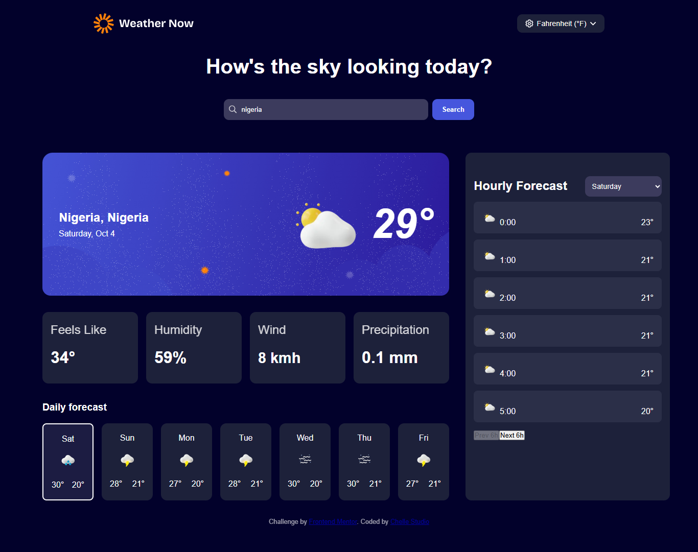

# Frontend Mentor - Weather app solution

This is a solution to the [Weather app challenge on Frontend Mentor](https://www.frontendmentor.io/challenges/weather-app-K1FhddVm49). Frontend Mentor challenges help you improve your coding skills by building realistic projects. 

**Note:** **Desktop view is fully implemented**. Mobile and tablet responsiveness are **currently in progress**.

## Table of contents

- [Overview](#overview)
  - [The challenge](#the-challenge)
  - [Screenshot](#screenshot)
  - [Links](#links)
- [My process](#my-process)
  - [Built with](#built-with)
  - [What I learned](#what-i-learned)
  - [Continued development](#continued-development)
  - [Useful resources](#useful-resources)
- [Author](#author)
- [Acknowledgments](#acknowledgments)

## Overview

### The challenge

Users should be able to:

- Search for weather information by entering a location in the search bar
- View current weather conditions including temperature, weather icon, and location details
- See additional weather metrics like "feels like" temperature, humidity percentage, wind speed, and precipitation amounts
- Browse a 7-day weather forecast with daily high/low temperatures and weather icons
- View an hourly forecast showing temperature changes throughout the day
- Switch between different days of the week using the day selector in the hourly forecast section
- Toggle between Imperial and Metric measurement units via the units dropdown 
- Switch between specific temperature units (Celsius and Fahrenheit) and measurement units for wind speed (km/h and mph) and precipitation (millimeters) via the units dropdown
- View the optimal layout for the interface depending on their device's screen size
- See hover and focus states for all interactive elements on the page

### Screenshot

**Note**: Mobile view is under development and will be added in the next update.


### Links

- Solution URL: [https://chelle-weather-forecast.netlify.app/](https://chelle-weather-forecast.netlify.app/)
- Live Site URL: [https://github.com/Ifeoluwayemisi/weather_forecast](https://github.com/Ifeoluwayemisi/weather_forecast)

## My process

### Built with

- Semantic HTML5 markup
- CSS custom properties
- Vanilla JavaScript (ES6+)
- CSS Grid & Flexbox
- Mobile-first workflow
- Open-Metro API(for weather & geocoding)
- CSS custom properties for theming
- Loading spinner for API calls

### What I learned

- How to integrate Open-Metro API for current, daily, and hourly weather data
- Creating a dynamic UI that updates on unit changes or daily/hourly selections
- Implementing pagination for hourly forecasts
- Managing state in vanilla JS for selected units and last searched location

```html
<h1>Some js code I'm proud of</h1>
```
```js
tempValue.textContent = `${Math.round(cw.temperature)}°`;
weatherIconEl.src = getWeatherIcon(cw.weathercode);
```

### Continued development

- Complete mobile and tablet responsive layouts 
- Add smoother animations/transitions for daily/hourly selection
- Enhance accessibility and keyboard navigation
- Optimize API calls and caching

### Useful resources

- [Open-Metro API Docs](https://open-meteo.com/en/docs) - For fetching weather and geocoding data.
- [MDN Date & Time](https://developer.mozilla.org/en-US/docs/Web/JavaScript/Reference/Global_Objects/Date) - Helpful for formatting dates and hours
- [Frontend Mentor Challenge](https://www.frontendmentor.io/challenges/weather-app-K1FhddVm49) - Original challenge reference

## Author

- Website - [Studio Chelle](https://olayoderacheal.netlify.app/)
- Frontend Mentor - [@Ifeoluwayemisi](https://www.frontendmentor.io/profile/Ifeoluwayemisi)
- Twitter - [@destinifeoluwa](https://x.com/destinifeoluwa?t=41uPuUNrLfGTwKOKNtCkhQ&s=09)


## Acknowledgments

- Inspired by the **Frontend Mentor challenge** and its example designs
- Thanks to **Open-Meteo** for providing a free weather API
